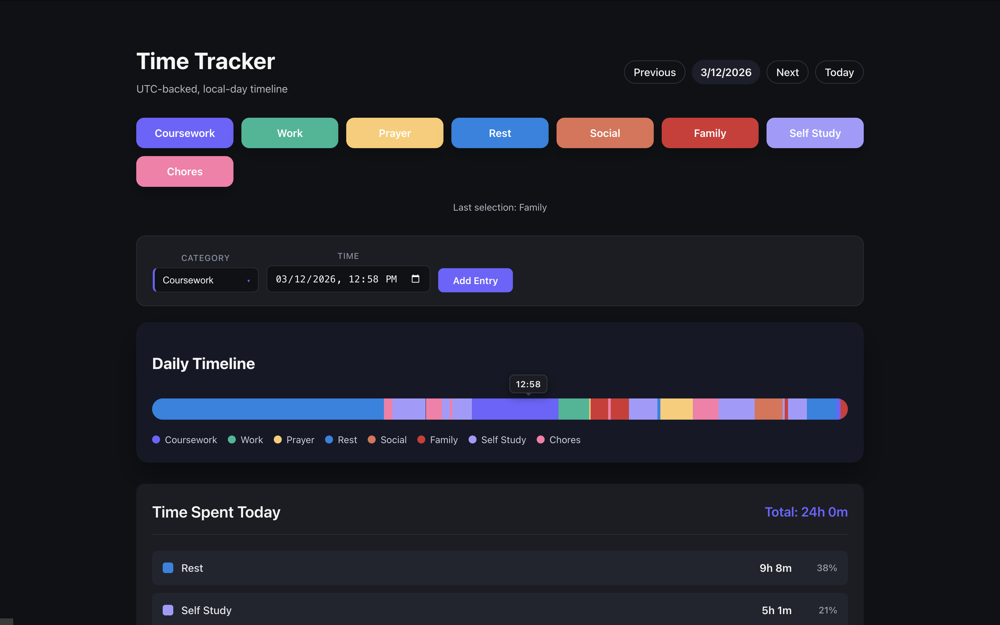

# Time Tracker

A modern, cloud-native time tracking application built with a serverless architecture on AWS, featuring real-time data visualization and one-click category tracking.

## Architecture Overview

**Frontend**: Vue 3 + TypeScript + Vite, deployed to S3 + CloudFront via GitHub Actions  
**Backend**: AWS Lambda (Python 3.11+) + API Gateway  
**Database**: DynamoDB with single-table design  
**CI/CD**: GitHub Actions for automated frontend deployment

## Features

### Core Functionality
- **One-click time tracking** across nine life categories: coursework, work, prayer, rest, social, family, chores, self-study, exercise
- **Interactive timeline visualization** showing daily activity distribution
- **Local timezone support** with UTC-backed storage for data consistency
- **Real-time updates** with optimistic UI patterns

### Technical Highlights
- **Serverless architecture**: Zero server maintenance, automatic scaling, pay-per-use pricing
- **DynamoDB single-table design**: Optimized access patterns with composite keys for efficient queries
- **RESTful API**: Clean API design with proper HTTP semantics via API Gateway
- **Type-safe frontend**: Full TypeScript implementation with Vue 3 Composition API
- **Responsive UI**: Compatible with both Mobile and Desktop views

## Tech Stack

### Frontend
- **Vue 3** with TypeScript
- **Modular component architecture** for maintainability

### Backend & Infrastructure
- **AWS Lambda**: Serverless compute with Python runtime
- **API Gateway**: RESTful API endpoint management with CORS support
- **DynamoDB**: NoSQL database with provisioned or on-demand capacity
- **IAM**: Fine-grained access control for Lambda execution roles

### Deployment & Hosting
- **S3**: Static website hosting for production frontend builds
- **CloudFront**: Global CDN for low-latency content delivery with edge caching
- **GitHub Actions**: Automated CI/CD pipeline for build, test, and deployment

## Future Enhancements

- Multi-user authentication with Amazon Cognito
- Custom domain with AWS Route 53
