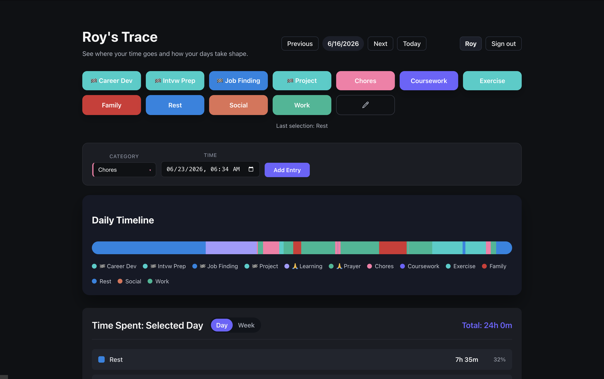

# Trace

<p align="center">
  
</p>

<p align="center">
  <a href="https://trace.royzhao.dev"><strong>Try Trace</strong></a>
  |
  <a href="#features">Features</a>
  |
  <a href="#local-development">Local development</a>
  |
  <a href="#deployment">Deployment</a>
</p>

<p align="center">
  <a href="https://trace.royzhao.dev">
    
  </a>
  
  
</p>

Trace is a time observability app for seeing where a day actually went. It
combines fast category-based logging, a visual timeline, Google sign-in, and a
serverless AWS backend so personal time history stays available across devices.

## Features

- **One-click time tracking** for daily categories such as coursework, work,
  prayer, rest, social, family, chores, self-study, and exercise.
- **Interactive daily and weekly views** that make time distribution easier to
  scan than a plain table of entries.
- **Manual entry support** for backfilling moments that were not captured live.
- **Google sign-in through Amazon Cognito** with user-scoped profiles,
  categories, and entries.
- **Shared guest mode** for public exploration without requiring visitors to
  create an account.
- **Timezone-aware history** with UTC-backed storage and local-day queries.
- **Responsive Vue UI** designed for both desktop and mobile use.

## Architecture

Trace is split into a static frontend and a serverless API.

| Layer | Technology |
| --- | --- |
| Frontend | Vue 3, TypeScript, Vite, Vitest |
| API | FastAPI, Mangum, AWS Lambda, API Gateway HTTP API |
| Auth | Amazon Cognito Hosted UI, Google federation, JWT authorization |
| Data | DynamoDB single-table design |
| Delivery | S3, CloudFront, GitHub Actions, AWS SAM |

The backend stores all user data in DynamoDB under user-scoped partition keys.
API Gateway validates Cognito ID tokens in production, while local development
can use development auth environment variables for faster iteration.

## Repository

```text
.
+-- backend/          # FastAPI app, Lambda handler, API tests
+-- docs/adr/         # Architecture decision records
+-- frontend/         # Vue application and frontend tests
+-- migration/        # DynamoDB migration utilities
+-- template.yaml     # AWS SAM infrastructure template
`-- README.md
```

## Local Development

### Prerequisites

- Node.js and npm
- Python 3.14
- AWS credentials with access to the configured DynamoDB table
- AWS SAM CLI and Docker for Lambda builds

### Frontend

```bash
cd frontend
npm install
VITE_API_BASE=http://localhost:8000 \
VITE_COGNITO_AUTHORITY=https://cognito-idp.us-east-2.amazonaws.com/<user-pool-id> \
VITE_COGNITO_CLIENT_ID=<user-pool-client-id> \
VITE_COGNITO_DOMAIN=https://<domain-prefix>.auth.us-east-2.amazoncognito.com \
npm run dev
```

For a pure local frontend pass, auth variables can be omitted, but production
sign-in requires the Cognito values emitted by the SAM stack.

### Backend

```bash
python -m venv .venv
.venv/bin/pip install -r backend/requirements.txt
.venv/bin/uvicorn backend.main:app --reload
```

The local API uses the v2 DynamoDB table, `time-tracker-v2`, unless configured
otherwise. To bypass API Gateway JWT claims locally, set:

```bash
DEV_AUTH_USER_ID=local-user
DEV_AUTH_EMAIL=local@example.com
DEV_AUTH_DISPLAY_NAME="Local User"
```

## Testing

Run frontend tests:

```bash
cd frontend
npm test
```

Run backend tests:

```bash
.venv/bin/pip install -r backend/requirements-dev.txt
.venv/bin/pytest backend/tests
```

## Deployment

### Backend and Infrastructure

`template.yaml` defines the SAM stack for Lambda, API Gateway, Cognito, CORS,
and the permissions needed to access the existing DynamoDB table.

```bash
sam validate --lint
sam build --use-container
sam deploy --guided
```

During the guided deploy, configure:

- `AllowedOrigins`: deployed frontend origins plus local origins as needed,
  for example `https://trace.royzhao.dev,http://localhost:5173`.
- `TimeTrackerTableName`: the target DynamoDB table name.
- `GoogleOAuthClientId` and `GoogleOAuthClientSecret`: values from a Google
  OAuth web client.
- `AllowedUserEmails`: a comma-separated allowlist, or `*` to allow any
  authenticated Google user.
- `CognitoDomainPrefix`: a globally unique Cognito Hosted UI domain prefix.
- `AuthCallbackUrls` and `AuthLogoutUrls`: frontend callback/logout origins.

After the first deploy, add the stack output `GoogleOAuthRedirectUri` to the
Google OAuth client as an authorized redirect URI. Then redeploy if Cognito
could not validate the provider on the first pass.

The stack output `ApiBaseUrl` becomes `VITE_API_BASE` for frontend builds.
Also use `CognitoAuthority`, `CognitoUserPoolClientId`, and
`CognitoHostedUiDomain` for the corresponding frontend environment variables.

After `samconfig.toml` has been created, deploy updates with:

```bash
sam build --use-container
sam deploy
```

SAM may ask whether the Lambda function can remain unauthenticated for each
HTTP API route. The HTTP API routes are protected by the default Cognito JWT
authorizer in `template.yaml`; those prompts refer to Lambda event permissions,
not an intentional public API surface.

### Frontend

The frontend is built with Vite and deployed as static assets to S3 behind
CloudFront.

```bash
cd frontend
npm install
npm run build
```

Production builds should provide:

```bash
VITE_API_BASE=<api-gateway-base-url>
VITE_COGNITO_AUTHORITY=<cognito-authority>
VITE_COGNITO_CLIENT_ID=<cognito-client-id>
VITE_COGNITO_DOMAIN=<cognito-hosted-ui-domain>
```

### CI/CD

GitHub Actions deploy the frontend and backend independently:

- Frontend workflow: `.github/workflows/deploy-frontend.yml`
- Backend workflow: `.github/workflows/deploy-backend.yml`

The backend workflow runs tests, validates the SAM template, builds the Lambda
artifact in a container, and deploys the SAM application. Configure cloud
credentials, OAuth secrets, and frontend environment variables in your
repository settings rather than committing them to the repo.

## API Summary

Production endpoints require:

```http
Authorization: Bearer <Cognito ID token>
```

Main routes:

- `GET /me` fetches or creates the authenticated user's profile.
- `PATCH /me` updates `displayName`.
- `GET /categories` returns active and inactive category definitions.
- `POST /categories` creates a validated category.
- `PATCH /categories/{categoryId}` renames, disables, or re-enables a category.
- `POST /entries` creates a time entry with `categoryId` and timestamp.
- `GET /entries-local` returns day or week entries for a local timezone/date.

Guest users can explore shared public tracking data, but profile and category
mutations are intentionally blocked.

## Migration

To migrate legacy single-user data from `USER#roy` after signing in once with
Google and finding the Cognito `sub`, run a dry run first:

```bash
python migration/migrate_user_partition.py \
  --from-user roy \
  --to-user <cognito-sub> \
  --email roy@example.com \
  --display-name Roy \
  --dry-run
```

Then run the same command without `--dry-run`. The migration copies items to
`USER#<cognito-sub>`, writes the DynamoDB profile item, and leaves the legacy
partition in place for rollback.

## Troubleshooting

If `sam deploy` fails with `S3 Bucket does not exist` while uploading the
Lambda artifact, SAM's managed artifact bucket may have been deleted while its
bootstrap CloudFormation stack remains. Recreate the managed bucket by deleting
only the SAM bootstrap stack, then deploy again:

```bash
aws cloudformation delete-stack \
  --stack-name aws-sam-cli-managed-default \
  --region us-east-2
aws cloudformation wait stack-delete-complete \
  --stack-name aws-sam-cli-managed-default \
  --region us-east-2
sam deploy
```

This does not delete the application stack or the DynamoDB table.

## Decisions

Architecture decision records live in `docs/adr/`:

- `0001-spa-refresh-token-renewal.md`
- `0002-manual-cognito-custom-domain-for-now.md`
- `0003-shared-public-guest-mode.md`
